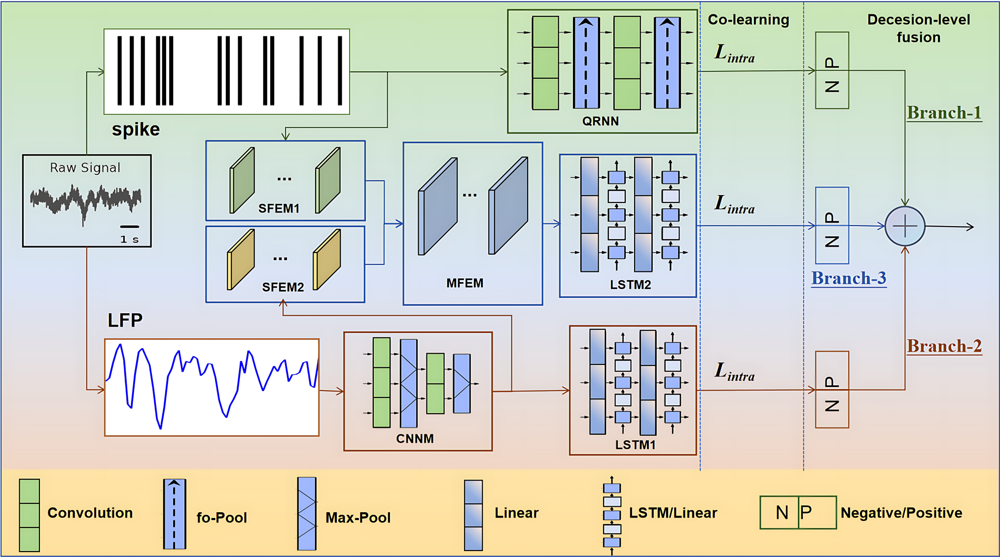

本代码库用于基于spike和LFP植入式脑电融合解码研究，a multi-scale spike-local field potential (LFP) fusion decoding framework (MFND)，支持从原始神经信号（神经元放电 Spike、局部场电位 LFP）预处理到深度学习模型训练、超参数优化的全流程操作。

环境依赖与配置说明

1. 基础环境要求
Python 版本：3.8+
深度学习框架：tensorflow-gpu 2.7（建议搭配 GPU 加速）

2. 核心依赖库
   
以下是项目运行必需的依赖库及对应版本：

absl-py                      2.0.0          # 基础工具库
attrs                        23.2.0         # 类属性管理
h5py                         3.10.0         # 处理HDF5格式数据（神经信号存储）
numpy                        1.26.2         # 科学计算基础库
pandas                       2.2.0          # 数据处理与分析
scikit-learn                 1.3.2          # 机器学习工具（评估指标）
scipy                        1.11.4         # 科学计算扩展（信号处理）
tensorflow                   2.17.0         # 深度学习框架（模型训练）
tensorflow-gpu               2.7.0          # GPU加速版本（可选）
keras                        3.4.1          # 高层神经网络API
optuna                       3.5.0          # 超参数优化框架
skopt                        0.10.2         # 贝叶斯优化工具（`scikit-optimize`）
xlwt                         1.3.0          # 生成Excel文件（结果保存）

含有“opt”代码是超参数优化代码，spikes+LFP_3fusion.py是MFND主程序。

数据获取：O'Doherty, J. E., Cardoso, M. M. B., Makin, J. G., & Sabes, P. N. (2017). Nonhuman Primate Reaching with Multichannel Sensorimotor Cortex Electrophysiology [Data set]. Zenodo. https://doi.org/10.5281/zenodo.583331
